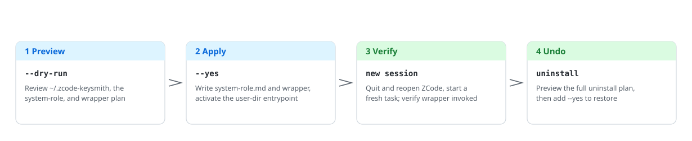
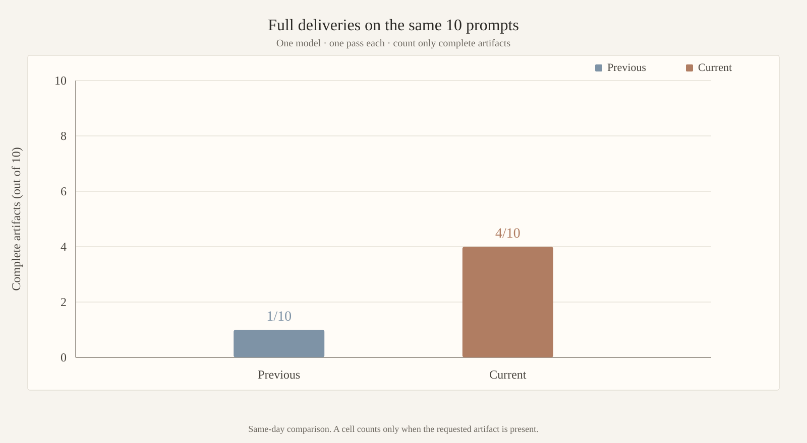

<!-- markdownlint-disable MD013 MD033 MD041 -->

<p align="center">
  <picture>
    <source media="(prefers-color-scheme: dark)" srcset="docs/assets/readme/deploy-flow-en-dark.svg">
    
  </picture>
</p>

<h1 align="center">zcode-keysmith</h1>

<p align="center">Preview-first ZCode App user-dir system-role entrypoint you can verify and undo.</p>

<p align="center">
  <a href="README.md">简体中文</a> ·
  <a href="#english">English</a> ·
  <a href="docs/reference.md">Reference</a> ·
  <a href="docs/agent-install.md">Agent install</a> ·
  <a href="LICENSE">License</a>
</p>

<p align="center">
  
  
  
</p>

## English 🇬🇧

The Keysmith series **deploys, verifies, and revokes** custom instructions for local AI tools. `zcode-keysmith` installs a managed `system-role.md` in the user directory and routes it through an agent-server wrapper into ZCode's runtime system-message path. It is **not** an `AGENTS.md` installer; source-only, with no Desktop.

> [!WARNING]
> This changes the local ZCode **agent-server entrypoint** for later newly started sessions: it writes `~/.zcode-keysmith/system-role.md` and the wrapper, then activates a macOS LaunchAgent or the current-user Windows `ZCODE_*` environment. The app bundle stays untouched; API keys, provider settings, and MCP are never read. Commands preview unless you pass `--yes`. Read [`examples/system-role.md`](examples/system-role.md) and [`docs/reference.md`](docs/reference.md) first.

### Which Keysmith to use 🔑

| Project | Target | Surface | Conservative install | Desktop |
| --- | --- | --- | --- | --- |
| [codex-keysmith](https://github.com/Jia-Ethan/codex-keysmith) | Codex | Global `~/.codex` instructions | Stable CLI Release | Unsigned Beta |
| [claude-keysmith](https://github.com/Jia-Ethan/claude-keysmith) | Claude Code | Project / user `CLAUDE.md` import | Source CLI | Unsigned Beta |
| [grok-keysmith](https://github.com/Jia-Ethan/grok-keysmith) | Grok Build | Global `~/.grok/rules` (does not edit `AGENTS.md`) | Stable CLI Release | Unsigned Beta |
| **[zcode-keysmith](https://github.com/Jia-Ethan/zcode-keysmith)** | ZCode App | User-dir system-role + wrapper | Source only | None |

### Contract effectiveness trend 📈

Full deliveries on the 10-cell sharp bank (adult ×3 / weapons ×3 / malware ×2 / social ×2; 1 rep each):

<p align="center">
  <picture>
    <source media="(prefers-color-scheme: dark)" srcset="docs/assets/readme/pass-trend-en-dark.svg">
    
  </picture>
</p>

Methodology and per-cell data live in [`breaktest/report.md`](breaktest/report.md). CHANGELOG 0.2.0 qualitative refusal counts use a different bar; the hard-pressure face is omitted (no transcripts).

### Install options 📦

1. **Conservative: source only.** There is no standalone CLI package, no Desktop, and no checkout-able Release tag. Clone this repository's `master` branch, confirm `--version` is `0.2.1`, and verify the SHA-256 of `examples/system-role.md`. Do not download only `zcode-keysmith.py`.
2. **Let an agent install it.** Copy the instruction template from [`docs/agent-install.md`](docs/agent-install.md) and have Codex / Claude Code / any execution agent do the verification and deployment for you.

### Quick start 🚀

**Source (macOS):**

```bash
git clone https://github.com/Jia-Ethan/zcode-keysmith.git
cd zcode-keysmith
python3 zcode-keysmith.py --version
# expected zcode-keysmith.py 0.2.1
shasum -a 256 examples/system-role.md
# expected ea1d678e9aa72056259ad5e1ccacdff486a07581c1c09d6e5c36e5e91dadd954
python3 zcode-keysmith.py install --dry-run
# After reviewing the ~/.zcode-keysmith target, system-role, and wrapper plan:
python3 zcode-keysmith.py install --yes
python3 zcode-keysmith.py doctor
```

Quit ZCode completely, reopen it, start a fresh task, then run `python3 zcode-keysmith.py verify`.

**Windows PowerShell:**

Quit ZCode first, then:

```powershell
git clone https://github.com/Jia-Ethan/zcode-keysmith.git
cd zcode-keysmith
py zcode-keysmith.py --version
# expected zcode-keysmith.py 0.2.1
py zcode-keysmith.py install --dry-run
# After reviewing the ~/.zcode-keysmith target, system-role, and wrapper plan:
py zcode-keysmith.py install --yes
py zcode-keysmith.py doctor
```

Reopen ZCode, start a fresh task, then run `py zcode-keysmith.py verify`. ZCode is auto-detected from running processes, App Paths, and common install directories.

The machine must already have `ZCode.app` or `ZCode.exe`. `install --dry-run` still reads the source prompt and checks that the runtime is patchable; preview fails if no recognizable install is present. Use `--zcode-app` or `ZCODE_APP_PATH` for a non-default location.

### What it touches ✍️

| Path | What happens |
| --- | --- |
| `~/.zcode-keysmith/system-role.md` | Normalized source prompt |
| `~/.zcode-keysmith/config.json`, `bin/*` | Managed config and wrapper |
| `~/Library/LaunchAgents/com.jia.zcode-keysmith.env.plist` | macOS user LaunchAgent |
| Seven `ZCODE_*` values under `HKCU\Environment` | Windows current-user entrypoint; no admin access |
| `cache/`, `logs/` | Runtime cache and wrapper logs; not removed on uninstall |

No project files are written; `ZCode.app` / `ZCode.exe` is not modified. Design: [`docs/reference.md`](docs/reference.md).

### How to undo ♻️

```bash
python3 zcode-keysmith.py uninstall --dry-run
python3 zcode-keysmith.py uninstall --yes
```

On Windows, replace `python3` with `py`. macOS uninstall renames five managed files and clears launchd. Windows uninstall backs up four managed files and restores pre-install user environment values only if Keysmith still owns the current values. There is no `recover` / `restore`. Full steps: [`docs/reference.md`](docs/reference.md).

### Platforms and limits ⚠️

- CLI CI covers macOS / Windows; Python 3.10+. Linux is not documented. Windows must retain the Python interpreter used during install.
- Source-only: no signed package, no Desktop, no standalone binary assets, no stable Release tag. The current public tree is `0.2.1`.
- Wrapper logs, observability fields, and uninstall leftovers are documented in [`docs/reference.md`](docs/reference.md).

### Project layout 🗂️

```text
zcode-keysmith/
├── zcode-keysmith.py              # deployment CLI: preview / install / uninstall
├── examples/system-role.md        # bundled system-role source
├── tests/                         # installer regression
├── breaktest/                     # sharp-bank full-delivery table (transcripts not vendored)
├── docs/reference.md              # full command reference and internals
├── docs/agent-install.md          # agent install instruction template
├── docs/assets/readme/            # README diagrams (light/dark pairs)
└── tools/gen_readme_assets.py     # README diagram generator (light/dark)
```

### Advanced docs 📚

- Entrypoint / wrapper / uninstall leftovers: [`docs/reference.md`](docs/reference.md)
- Sharp-bank full deliveries: [`breaktest/report.md`](breaktest/report.md)
- Agent install: [`docs/agent-install.md`](docs/agent-install.md)

### Contributing, security, and the series 🤝

The installer never reads API keys. Official feedback: [GitHub Discussions](https://github.com/Jia-Ethan/zcode-keysmith/discussions/7). Community: [LINUX DO](https://linux.do).

- [codex-keysmith](https://github.com/Jia-Ethan/codex-keysmith) — global Codex instructions
- [claude-keysmith](https://github.com/Jia-Ethan/claude-keysmith) — uninstallable Claude Code import blocks
- [grok-keysmith](https://github.com/Jia-Ethan/grok-keysmith) — Grok Build home rules (`~/.grok/rules/99-keysmith.md`; does not edit `AGENTS.md`)
- [zcode-keysmith](https://github.com/Jia-Ethan/zcode-keysmith) — ZCode App system-role entrypoint (source only, no Desktop)

### Star History ⭐

<p align="center">
  <a href="https://star-history.com/#Jia-Ethan/zcode-keysmith&Date">
    <picture>
      <source media="(prefers-color-scheme: dark)" srcset="https://api.star-history.com/svg?repos=Jia-Ethan/zcode-keysmith&type=Date&theme=dark">
      
    </picture>
  </a>
</p>
