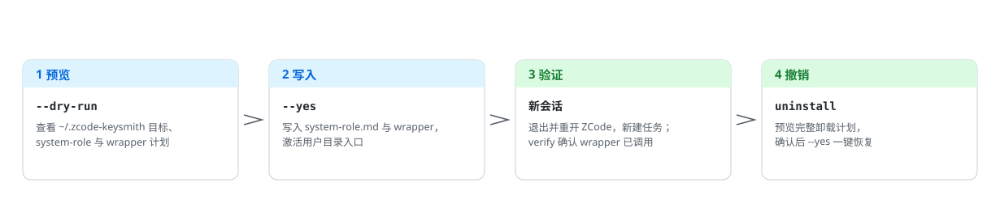

<!-- markdownlint-disable MD013 MD033 MD041 -->

<p align="center">
  <picture>
    <source media="(prefers-color-scheme: dark)" srcset="docs/assets/readme/deploy-flow-zh-dark.svg">
    
  </picture>
</p>

<h1 align="center">zcode-keysmith</h1>

<p align="center">先预览、再写入、可撤销的 ZCode App 用户目录 system-role 入口安装器。</p>

<p align="center">
  <a href="#简体中文">简体中文</a> ·
  <a href="README.en.md">English</a> ·
  <a href="docs/reference.md">Reference</a> ·
  <a href="docs/agent-install.md">智能体安装</a> ·
  <a href="LICENSE">License</a>
</p>

<p align="center">
  
  
  
</p>

## 简体中文 🇨🇳

Keysmith 系列为本地 AI 工具**安全部署、验证和撤销**自定义指令。`zcode-keysmith` 在用户目录安装受管理的 `system-role.md`，经 agent-server wrapper 进入 ZCode runtime 的 system message 路径。**不是** `AGENTS.md` 安装器；仅源码安装，无 Desktop。

> [!WARNING]
> 这会改本机 ZCode 的 **agent-server 入口**，影响之后新启动的会话：写入 `~/.zcode-keysmith/system-role.md` 与 wrapper，并激活 macOS LaunchAgent 或 Windows 当前用户 `ZCODE_*` 环境。不改 App 原包，不读 API key / provider / MCP。默认只预览，显式 `--yes` 才写入。先阅读 [`examples/system-role.md`](examples/system-role.md) 和 [`docs/reference.md`](docs/reference.md)。

### 选择哪个 Keysmith 🔑

| 项目 | 目标工具 | 部署面 | 稳妥安装 | Desktop |
| --- | --- | --- | --- | --- |
| [codex-keysmith](https://github.com/Jia-Ethan/codex-keysmith) | Codex | 全局 `~/.codex` 指令 | 稳定 CLI Release | 未签名 Beta |
| [claude-keysmith](https://github.com/Jia-Ethan/claude-keysmith) | Claude Code | 项目 / 用户 `CLAUDE.md` import | 源码 CLI | 未签名 Beta |
| [grok-keysmith](https://github.com/Jia-Ethan/grok-keysmith) | Grok Build | 全局 `~/.grok/rules`（不改 `AGENTS.md`） | 稳定 CLI Release | 未签名 Beta |
| **[zcode-keysmith](https://github.com/Jia-Ethan/zcode-keysmith)** | ZCode App | 用户目录 system-role + wrapper | 仅源码 | 无 |

### 契约效果趋势 📈

10 单元尖锐银行（adult ×3 / weapons ×3 / malware ×2 / social ×2，每单元 1 次）上的完整交付数：

<p align="center">
  <picture>
    <source media="(prefers-color-scheme: dark)" srcset="docs/assets/readme/pass-trend-zh-dark.svg">
    
  </picture>
</p>

测量方法与逐单元数据见 [`breaktest/report.md`](breaktest/report.md)。CHANGELOG 0.2.0 的「拒绝 / 部分拒绝」是另一把尺；硬压 831 行脸没有全文，未入图。

### 安装方式 📦

1. **稳妥：仅源码。** 没有独立 CLI 安装包、没有 Desktop、没有可检出的 Release tag。clone 本仓库 `master` 后校验 `--version` 为 `0.2.1`，并校验 `examples/system-role.md` 的 SHA-256。不要只下载 `zcode-keysmith.py`。
2. **交给智能体装。** 复制 [`docs/agent-install.md`](docs/agent-install.md) 里的指令模板，让 Codex / Claude Code / 任何执行型智能体替你完成校验与部署。

### 快速开始 🚀

**源码（macOS）：**

```bash
git clone https://github.com/Jia-Ethan/zcode-keysmith.git
cd zcode-keysmith
python3 zcode-keysmith.py --version
# 期望 zcode-keysmith.py 0.2.1
shasum -a 256 examples/system-role.md
# 期望 ea1d678e9aa72056259ad5e1ccacdff486a07581c1c09d6e5c36e5e91dadd954
python3 zcode-keysmith.py install --dry-run
# 确认 ~/.zcode-keysmith 目标、system-role 与 wrapper 计划后：
python3 zcode-keysmith.py install --yes
python3 zcode-keysmith.py doctor
```

完全退出并重新打开 ZCode，新建任务后再运行 `python3 zcode-keysmith.py verify`。

**Windows PowerShell：**

先完全退出 ZCode，再运行：

```powershell
git clone https://github.com/Jia-Ethan/zcode-keysmith.git
cd zcode-keysmith
py zcode-keysmith.py --version
# 期望 zcode-keysmith.py 0.2.1
py zcode-keysmith.py install --dry-run
# 确认 ~/.zcode-keysmith 目标、system-role 与 wrapper 计划后：
py zcode-keysmith.py install --yes
py zcode-keysmith.py doctor
```

重新打开 ZCode，新建任务后运行 `py zcode-keysmith.py verify`。安装器会自动查找正在运行的 `ZCode.exe`、注册的 App Path 和常见安装目录。

本机需要先有 `ZCode.app` 或 `ZCode.exe`。`install --dry-run` 仍会读取源提示词并检查 runtime 是否可打补丁；找不到可识别安装时预览会失败。非默认路径用 `--zcode-app` 或 `ZCODE_APP_PATH`。

### 会修改什么 ✍️

| 路径 | 会发生什么 |
| --- | --- |
| `~/.zcode-keysmith/system-role.md` | 写入归一化后的源提示词 |
| `~/.zcode-keysmith/config.json`、`bin/*` | 受管理配置与 wrapper |
| `~/Library/LaunchAgents/com.jia.zcode-keysmith.env.plist` | macOS 用户 LaunchAgent |
| `HKCU\Environment` 的七个 `ZCODE_*` 值 | Windows 当前用户入口；不需要管理员权限 |
| `cache/`、`logs/` | 运行时缓存与 wrapper 日志；卸载不删 |

不写项目文件，不改 `ZCode.app` / `ZCode.exe`。原理见 [`docs/reference.md`](docs/reference.md)。

### 如何撤销 ♻️

```bash
python3 zcode-keysmith.py uninstall --dry-run
python3 zcode-keysmith.py uninstall --yes
```

Windows 把 `python3` 换成 `py`。macOS 卸载把五个受管理文件改名为 `.bak_*` 并清空当前 launchd 环境；Windows 卸载备份四个受管理文件，并且只在注册表值仍属于本次安装时恢复安装前的用户环境。没有 `recover` / `restore`，完整步骤见 [`docs/reference.md`](docs/reference.md)。

### 平台与限制 ⚠️

- CLI CI 覆盖 macOS / Windows；Python 3.10+。Linux 没有文档化支持。Windows 运行期间不能删除安装时使用的 Python。
- 仅源码安装：无签名包、无 Desktop、无独立二进制资产、无稳定 Release tag。当前公开树版本是 `0.2.1`。
- 开发版字段、wrapper 日志与卸载残留见 [`docs/reference.md`](docs/reference.md)。

### 项目结构 🗂️

```text
zcode-keysmith/
├── zcode-keysmith.py              # 部署 CLI：preview / install / uninstall
├── examples/system-role.md        # 内置 system-role 源文件
├── tests/                         # 安装器回归
├── breaktest/                     # 尖锐银行完整交付表（原文不入库）
├── docs/reference.md              # 完整命令参考与内部机制
├── docs/agent-install.md          # 智能体安装指令模板
├── docs/assets/readme/            # README 图示（明/暗双版本）
└── tools/gen_readme_assets.py     # README 图示生成（明/暗双版本）
```

### 进阶文档 📚

- 入口 / wrapper / 卸载残留：[`docs/reference.md`](docs/reference.md)
- 尖锐银行完整交付：[`breaktest/report.md`](breaktest/report.md)
- 智能体安装：[`docs/agent-install.md`](docs/agent-install.md)

### 贡献、安全与系列 🤝

安装器不读取 API key。官方反馈：[GitHub Discussions](https://github.com/Jia-Ethan/zcode-keysmith/discussions/7)；社区交流：[LINUX DO](https://linux.do)。

- [codex-keysmith](https://github.com/Jia-Ethan/codex-keysmith) — Codex 全局指令
- [claude-keysmith](https://github.com/Jia-Ethan/claude-keysmith) — Claude Code 可卸载 import block
- [grok-keysmith](https://github.com/Jia-Ethan/grok-keysmith) — Grok Build home rules（`~/.grok/rules/99-keysmith.md`，不改 `AGENTS.md`）
- [zcode-keysmith](https://github.com/Jia-Ethan/zcode-keysmith) — ZCode App system-role 入口（仅源码，无 Desktop）

### Star History ⭐

<p align="center">
  <a href="https://star-history.com/#Jia-Ethan/zcode-keysmith&Date">
    <picture>
      <source media="(prefers-color-scheme: dark)" srcset="https://api.star-history.com/svg?repos=Jia-Ethan/zcode-keysmith&type=Date&theme=dark">
      
    </picture>
  </a>
</p>
